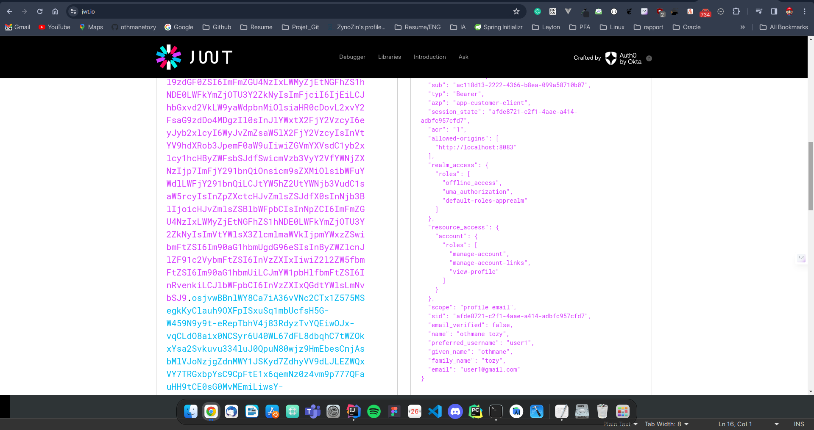
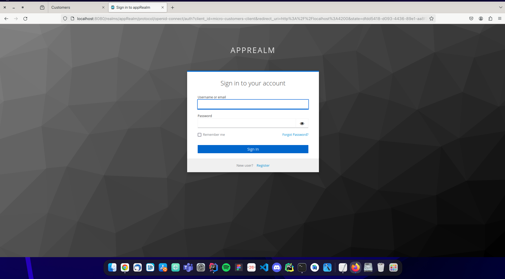
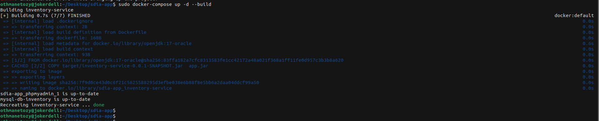

#  Compte rendu

<h3>Introduction</h3>
Notre projet Spring Boot et Spring Security, intégrant Thymeleaf pour le rendu côté serveur, assure une application web robuste. En optimisant la sécurité, nous avons intégré Keycloak pour une authentification et une gestion des autorisations avancées, garantissant une protection totale des données.

Parallèlement, l'ajout du microservice inventory-service, sécurisé avec les mécanismes de Spring Boot et Keycloak, renforce la modularité et la sécurité de l'ensemble du système. Cette approche assure une expérience utilisateur fiable et sécurisée, avec une attention particulière portée à chaque composant du projet.

## Oauth2
OAuth 2.0 est un protocole d'autorisation et NON un protocole d'authentification. En tant que tel, il est principalement conçu comme un moyen d'accorder l'accès à un ensemble de ressources, par exemple, des API distantes ou des données utilisateur.

## OIDC

OIDC, ou OpenID Connect, est un protocole d'authentification et d'autorisation conçu sur la base du protocole OAuth 2.0. Il vise à standardiser les processus d'authentification et de gestion des autorisations dans le contexte des applications web et des services API.

## Keycloack

Mon projet intègre Keycloak en tant que fournisseur d'identité, utilisant le protocole OpenID Connect (OIDC) pour sécuriser le processus d'authentification des utilisateurs. Grâce à Keycloak, nous bénéficions d'une gestion avancée des autorisations, assurant un contrôle précis de l'accès aux ressources sensibles de notre application. Cette intégration renforce significativement la sécurité, garantissant une expérience utilisateur fiable. Ainsi, Keycloak constitue une composante essentielle de notre architecture, assurant une protection robuste et efficace des données et des services.

<h5>Installation keycloak</h5>

L'intégration fluide de Keycloak dans notre infrastructure a été réalisée en déployant avec succès une instance via Docker. Cette approche simplifiée garantit une gestion robuste des identités et des autorisations, renforçant ainsi la sécurité de notre application.

<h3>Keycloak Login </h3>

<h3>Keycloak configuration </h3>

<h3>Application page (HOME)</h3>

<h3>Provider</h3>
L'élargissement des options d'authentification de notre application a été réalisé en ajoutant les fournisseurs d'identité Google, GitHub et Keycloak. Cette diversification permet aux utilisateurs de choisir entre les méthodes d'authentification de leur choix, qu'il s'agisse de comptes Google, GitHub ou du système sécurisé de Keycloak. L'intégration soigneuse de ces fournisseurs garantit une expérience d'authentification harmonieuse, tout en préservant la sécurité des données et en assurant la conformité aux normes élevées de notre application. Ainsi, notre système offre non seulement une variété d'options aux utilisateurs, mais maintient également une sécurité robuste.
* Endpoint = localhost:8083/Oauth2Login 

<h3>Testing end point</h4>

## Part 2 : Securiser l'application en utilisation spring boot et Angular 

## Angular 
Angular est un framework pour clients, open source, basé sur TypeScript et codirigé par l'équipe du projet « Angular » chez Google ainsi que par une communauté de particuliers et de sociétés. Angular est une réécriture complète d'AngularJS,

<h3>Creation d'un nouveau Client dans Keycloack </h3>

Afin de résoudre un problème d'affichage des produits dans la liste de notre interface Angular, j'ai momentanément désactivé la sécurité. Les produits sont gérés par le service inventory-service. Pour assurer une communication fluide avec ce service, j'ai résolu les problèmes CORS, garantissant ainsi une connectivité efficace entre le frontend et le service. Cette solution temporaire a permis d'identifier et de résoudre le problème sous-jacent, ouvrant la voie à une sécurisation adéquate tout en maintenant une interaction optimale.

* J'ai amélioré la sécurité de mon application Angular en intégrant un garde de route, appelé 'AuthGuard', qui utilise la bibliothèque keycloak-angular. Ce garde assure que l'accès à certaines parties de l'application est limité aux utilisateurs authentifiés et autorisés grâce aux fonctionnalités d'authentification et d'autorisation de Keycloak. Cette intégration renforce la sécurité et garantit une expérience utilisateur cohérente, en limitant l'accès aux utilisateurs authentifiés avec les rôles appropriés.

Les récents commits ont réorganisé le système d'autorisation de l'application, permettant un accès complet aux fonctionnalités liées aux produits pour les administrateurs tout en restreignant délibérément l'accès pour les utilisateurs standard. Ces ajustements visent à renforcer la sécurité de l'application en assurant un contrôle précis des autorisations en fonction des rôles des utilisateurs, marquant ainsi un engagement envers une expérience utilisateur plus sécurisée et personnalisée.

## Part 3 : Deploiment d'une architecture microservice avec Docker
 <h3>Introduction</h3>
 Docker est une plate-forme logicielle qui vous permet de concevoir, tester et déployer des applications rapidement. Docker intègre les logiciels dans des unités normalisées appelées conteneurs, qui rassemblent tous les éléments nécessaires à leur fonctionnement, dont les bibliothèques, les outils système, le code et l'environnement d'exécution. Avec Docker, vous pouvez facilement déployer et dimensionner des applications dans n'importe quel environnement, avec l'assurance que votre code s'exécutera correctement. 

récemment, j'ai optimisé mon environnement de développement en intégrant Docker Compose. Cette intégration simplifie le déploiement et la gestion de deux conteneurs essentiels : l'un dédié à PHPMyAdmin et l'autre à MySQL. En parallèle, j'ai automatisé la création de la base de données, garantissant une initialisation transparente. L'utilisation de Docker Compose améliore considérablement l'efficacité et la reproductibilité de l'infrastructure, offrant une solution robuste pour orchestrer PHPMyAdmin et MySQL dans mon environnement de développement.

Récemment, j'ai dockerisé mon service "inventory-service". Cette démarche a simplifié le déploiement de l'application en encapsulant son environnement et ses dépendances dans un conteneur Docker. Grâce à cette approche, j'ai gagné en portabilité et en efficacité, permettant une exécution cohérente du service indépendamment de l'environnement sous-jacent. Cette dockerisation offre également une gestion optimale des ressources, contribuant à une mise en production plus rapide et à une maintenance simplifiée de mon service "inventory-service".

